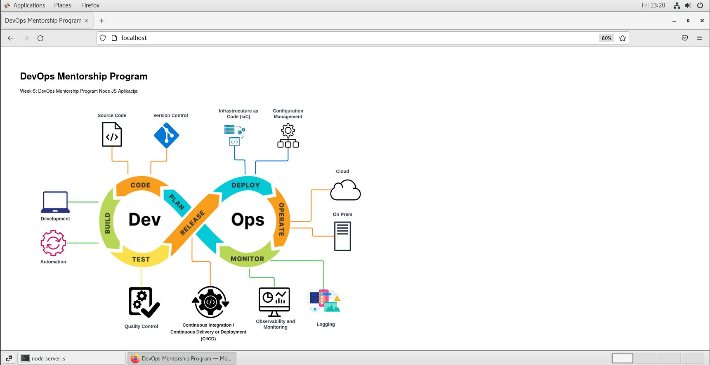

# Week-5 DevOps Mentorship Program
Topics: Web Servers, Application Servers, NGINX, Apache, SSL/TLS  
Homework: Running NodeJS application on localhost using Nginx with reverse proxy 

NodeJS app running on Nginx : 

