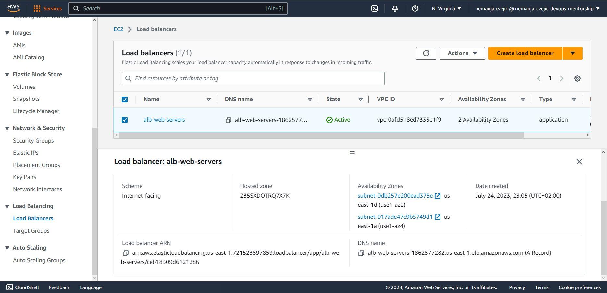

# Week-8 DevOps Mentorship Program
Topics: AMI Image, Application Load Balancer, Security Groups, EBS, ASG 
Homework: Create Autoscaling Group and Load Balancer  

Application Load Balancer : 

Auto Scaling Group : 

Accessing a web server through an application load balancer's DNS name : 

Diagram created with Lucidchart : 

