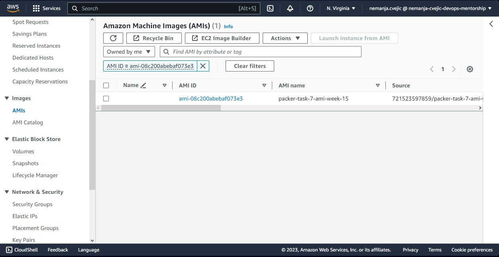
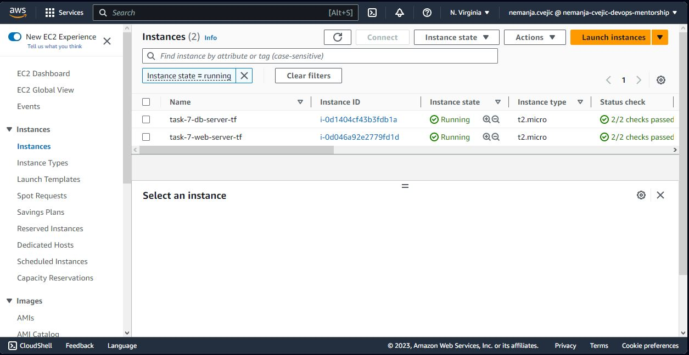
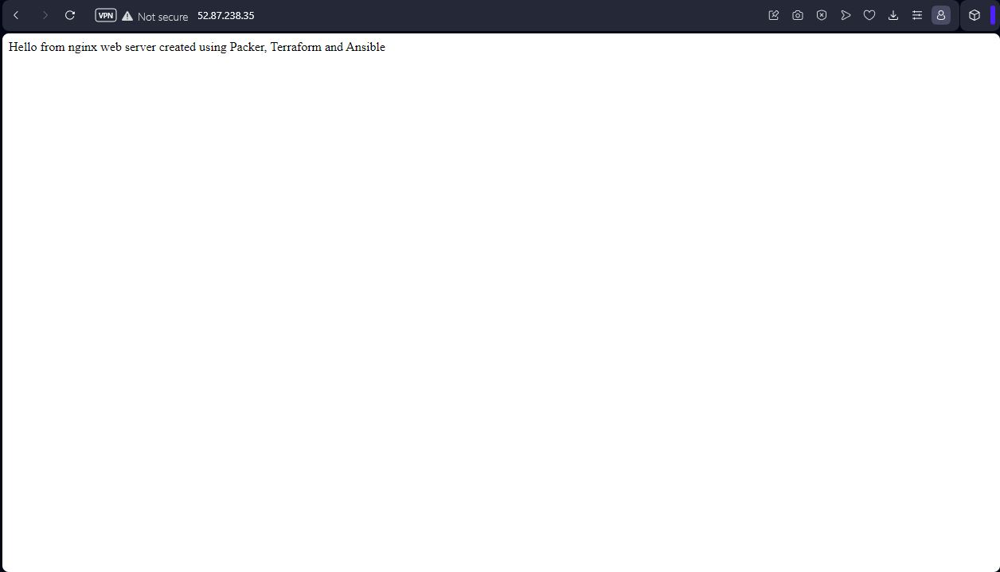

# Week-15 DevOps Mentorship Program 
Topics: <ul>
<li>Configuration management: Packer, Ansible</li>
<li>Infrastructure as Code: Terraform</li>
</ul> 
Homework: Packer - > Terraform -> Ansible  

Custom AMI made with Packer:  

EC2 instances made with Terraform and Custom AMI made in the previous step :  

NGINX web server successfully installed and enabled on the web server EC2 instance:  

 

